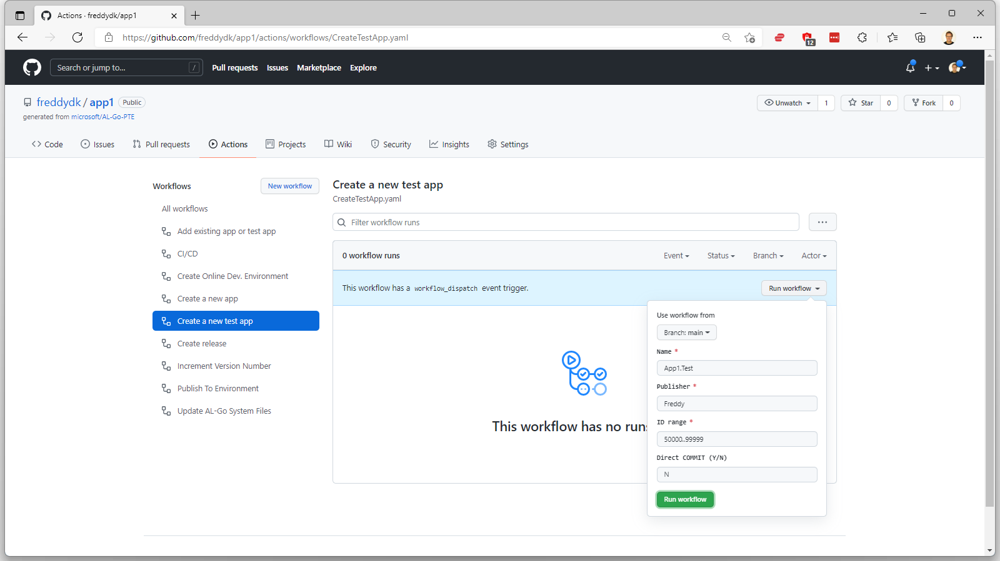
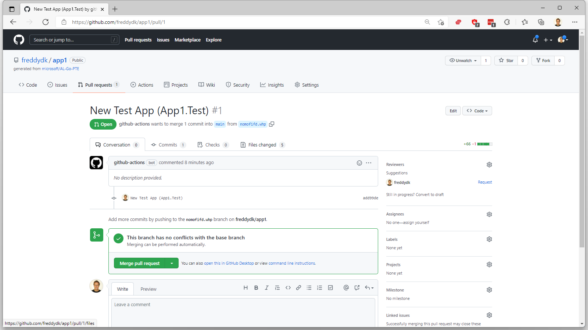
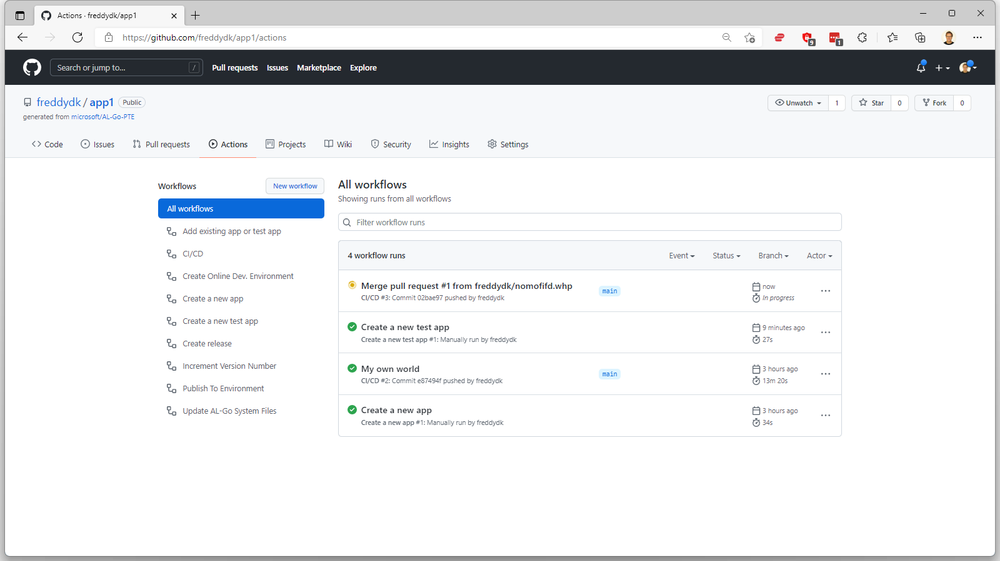
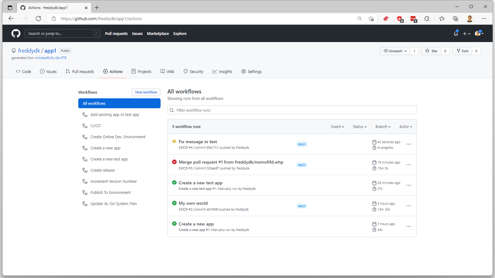
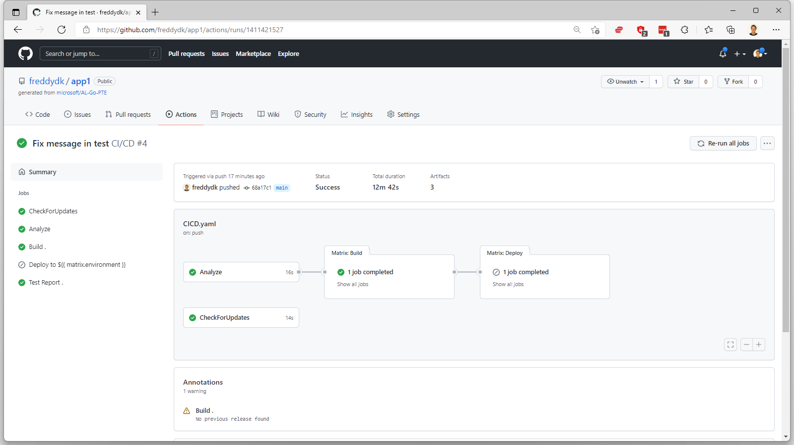

# #2 Add a test app to an existing project
*Prerequisites: A completed [scenario 1](GetStarted.md)*

1. On **github.com**, open **Actions** on your solution, select **Create a new test app** and then choose **Run workflow**. Enter values for **name**, **publisher**, and **ID range** and choose **Run workflow**

1. When the workflow is done, navigate to **Pull Requests**, **inspect the PR** and **Merge the pull request**

1. Under **Actions**, you will see that a Merge pull request CI workflow has been kicked off

1. If you wait for the workflow to complete, you will see that it fails.

1. Inspecting the build, you can see the details of the error.

1. To fix this, open VS Code, pull changes from the server using the sync button, open the **HelloWorld.Test.al** file and fix the test message.

1. Stage, Commit, and Push the change. On github.com, under **Actions** you will see that your check-in caused another CI workflow to be kicked off.

1. This time it should be passing and if you investigate the CI/CD workflow, you will see that the deploy step has been skipped as no environment existed.

---
[back](../README.md)
