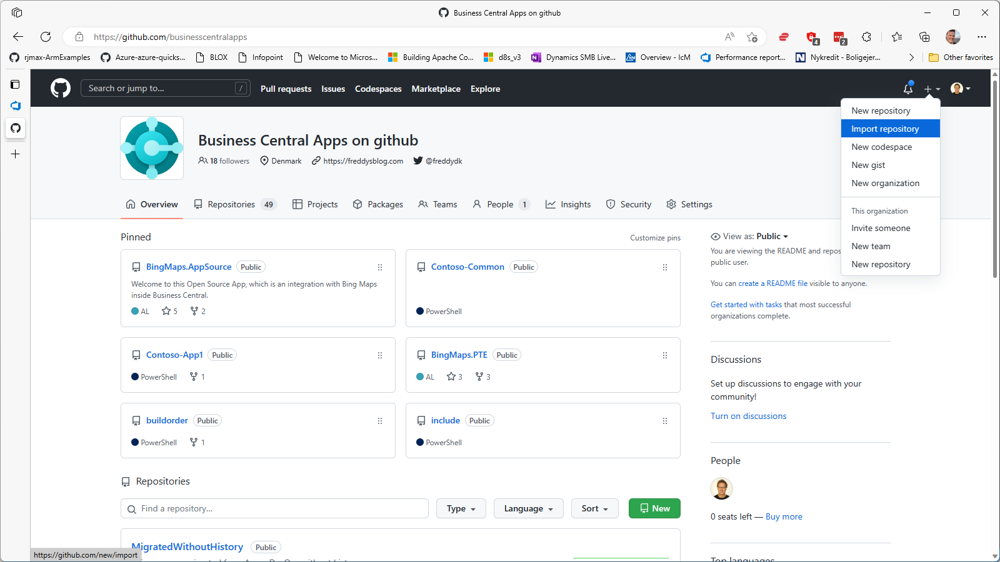
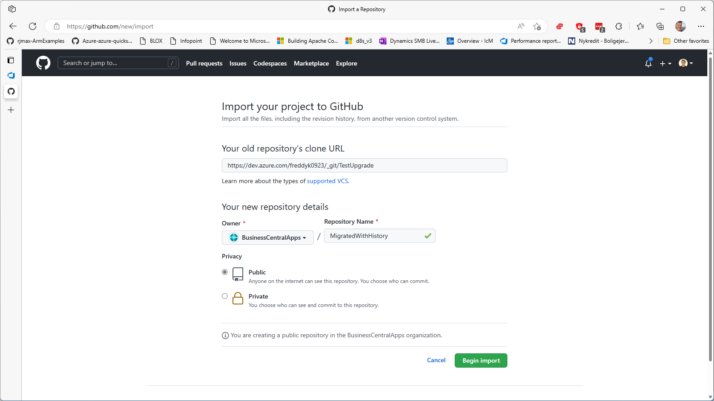
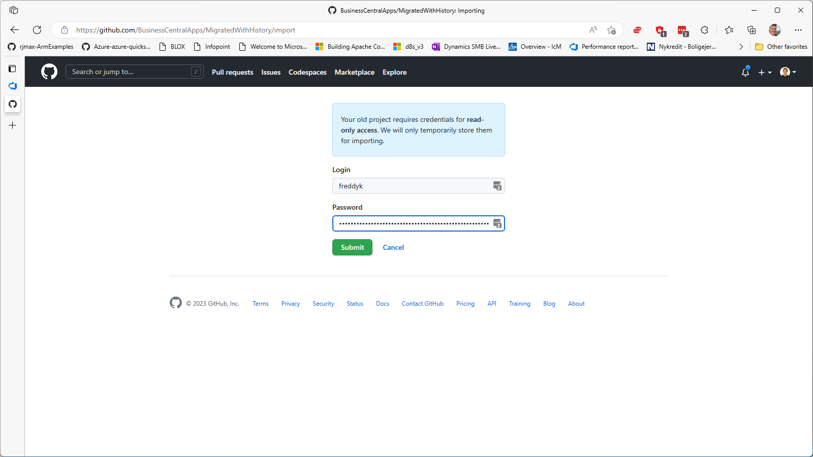
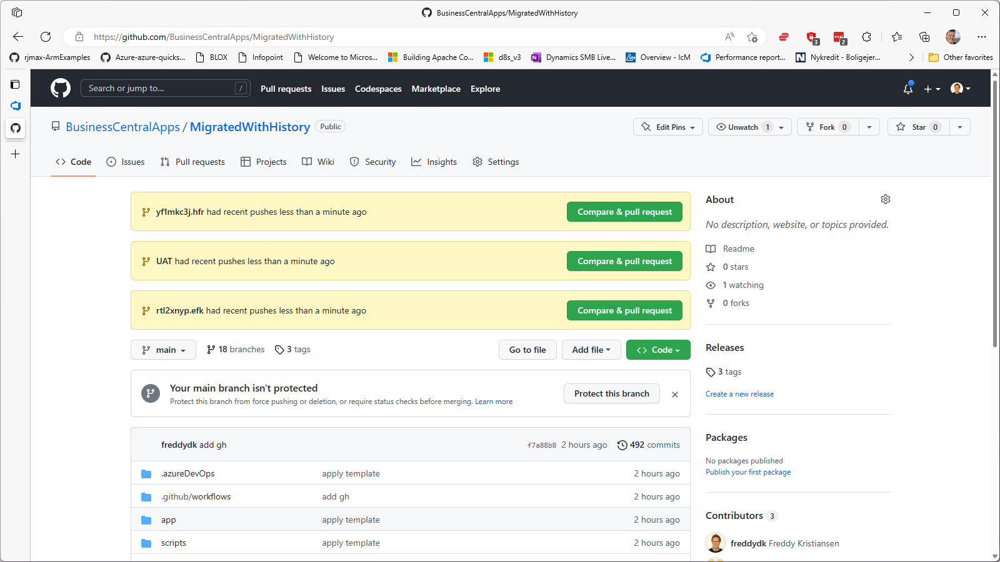
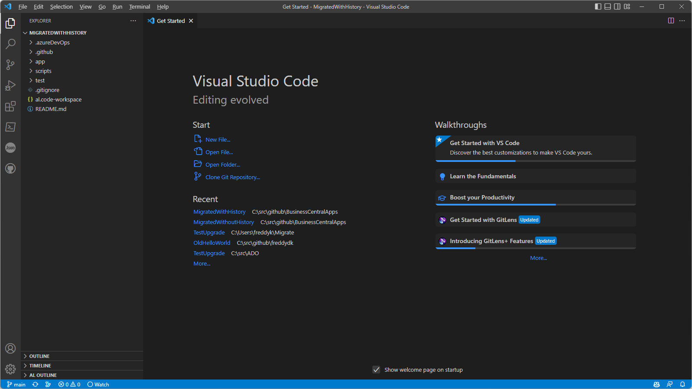
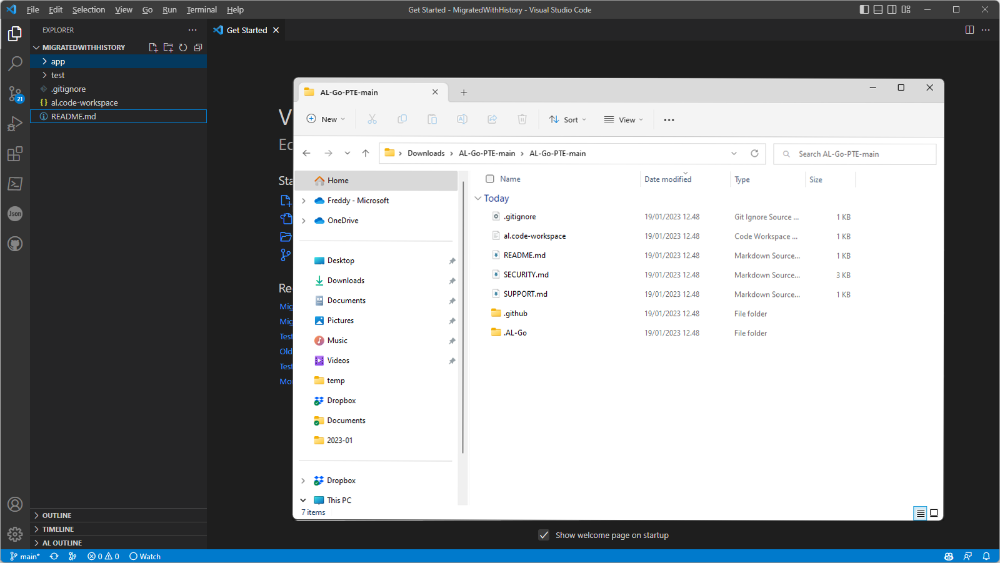
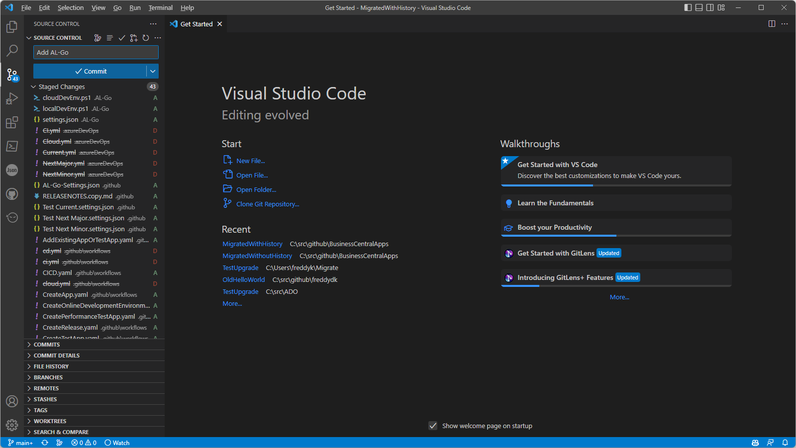
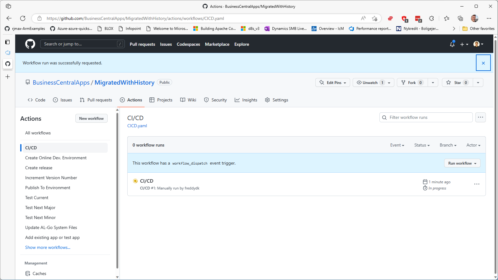
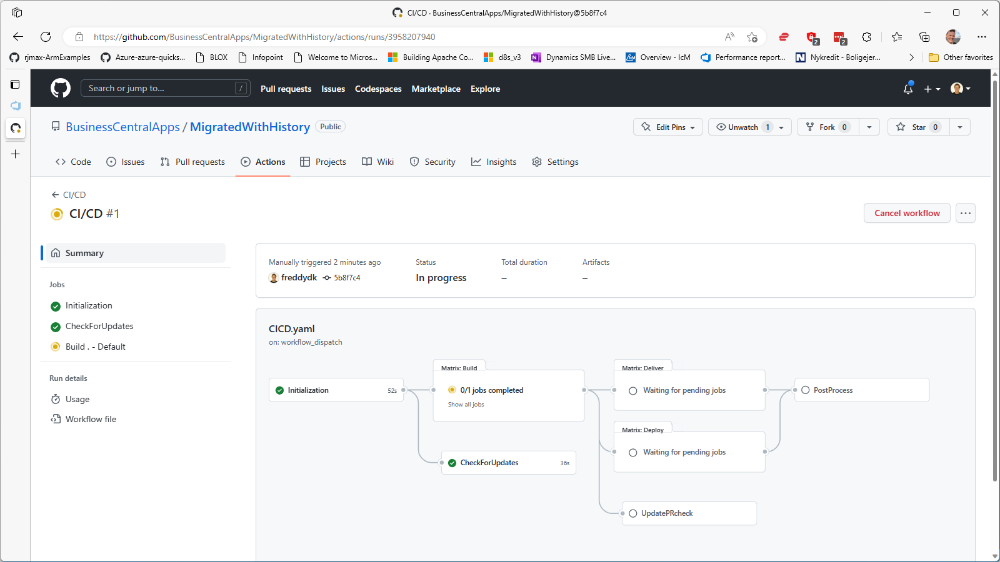
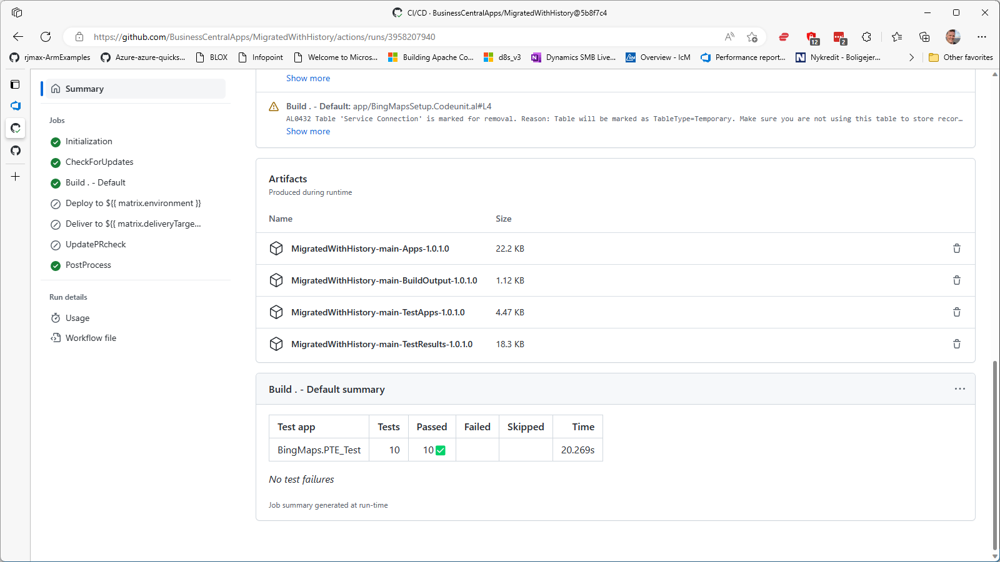

# #A Migrate a repository from Azure DevOps to AL-Go for GitHub with history
*This walkthrough explains how to migrate a repository from Azure DevOps to AL-Go for GitHub **while preserving the full commit history**. As a sample, I will use a repository, which was setup using the CI/CD Hands On Lab, including scripts and pipelines from this.*

*If you do not want to preserve the full commit history, you should use [this walkthrough](MigrateFromAzureDevOpsWithoutHistory.md) or [Scenario 11](SetupCiCdForExistingAppSourceApp.md)*

***Note: This walkthrough will leave your existing Azure DevOps repository untouched and you can decide to keep working in that if you like.***

1. Start out by navigating to your **Azure DevOps** repository. Click the **Clone** button and click **Generate Git Credentials**.

1. Copy the password to the clipboard, navigate to GitHub, login and click the small + menu in the top right corner and select **Import repository**.

1. Enter the GIT URL to the old repository and choose the owner+name of the repository and specify privacy. Click **Begin Import**.

1. If your GIT repository requires authentication, you will be asked to provie this.

1. After GitHub is done importing your repo, you can navigate to the repo.

1. In the new repository, you might see different messages about branches and PRs. This is because GitHub has imported everything. Ignore this for now Click the **<> Code** button and copy the git address to the clipboard.

1. Open VS Code, press Ctrl+Shift+P, select **Git Clone** and paste your git URL into the address bar. Select a location, clone and open the repo and open the Repo in VS Code.

1. Delete the files and folders that are not needed in AL-Go for GitHub (including .github, .azureDevOps, .pipelines and scripts folders), leaving only your apps, your test apps and other files you want to preserve.

1. Now, download the AL-Go template needed, either the [PTE template](https://github.com/microsoft/AL-Go-PTE/archive/refs/heads/main.zip) or the [AppSource Template](https://github.com/microsoft/AL-Go-AppSource/archive/refs/heads/main.zip). Unpack the .zip file and open the unpacked template files.

1. Drag the needed files and folders from the .zip file into VS Code (at a minimum the .AL-Go folder and the .github folder) and select to **Copy the folders**.

1. Modify any settings necessary for the app. Typical settings you might need to modify are:
    - appFolders, see https://aka.ms/algosettings#appfolders
    - testFolders, see https://aka.ms/algosettings#testfolders
    - appSourceMandatoryAffixes, see https://aka.ms/algosettings#appSourceMandatoryAffixes
    - enableAppSourceCop, see https://aka.ms/algosettings#enableAppSourceCop 
    - enablePerTenantExtensionCop, see https://aka.ms/algosettings#enablePerTenantExtensionCop
    - enableCodeCop, see https://aka.ms/algosettings#enableCodeCop
    - enableUICop, see https://aka.ms/algosettings#enableUICop
    - rulesetFile, see https://aka.ms/algosettings#rulesetFile
    - runNumberOffset, see https://aka.ms/algosettings#runNumberOffset

    Also, if you are migrating an AppSource App, you will need to create a secret called LicenseFileUrl, which should contain a secure direct download URL to your license file, as mentioned [here](SetupCiCdForExistingAppSourceApp.md).

    Finally, if you want AL-Go for GitHub to digitally sign your file, you need to create two secrets in the repository (or in the organization) called **CodeSignCertificateUrl** and **CodeSignCertificatePassword**, being a secure direct download URL to your PFX certificate and the PFX password for the certificate.

    See a list of all settings [here](settings.md).

1. In VS Code, in the Source Control area, **Add** all changed files, **Commit** the changes and press **Sync Changes** to push to GitHub.

1. Navigate back to your repository on GitHub. See that your files have been uploaded. Click **Settings** -> **Actions** -> **General**, select **Allow all actions and reusable workflows** and click **Save**.

1. Click **Actions**, select the **CI/CD** workflow and click **Run workflow** to manually run the CI/CD workflow.

1. Open the running workflow to see status and summary and wait for the build to complete.

1. Scroll down to see the artifacts and the test results

1. Navigate to **Code** and click **Commits** to see the history and all your commits.

---
[back](../README.md)
