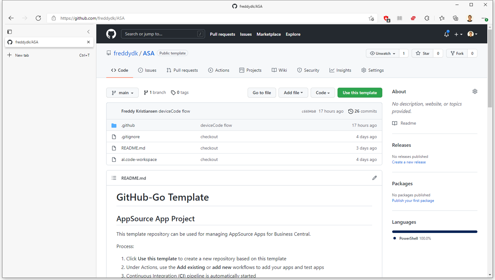
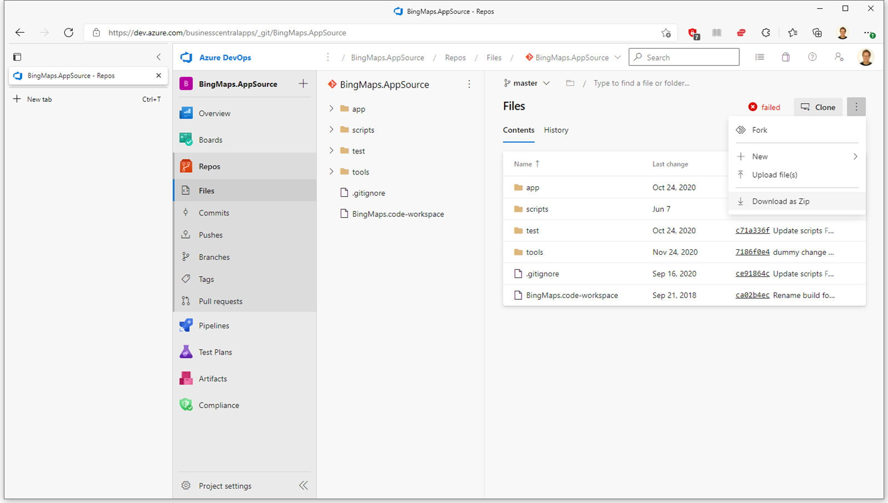
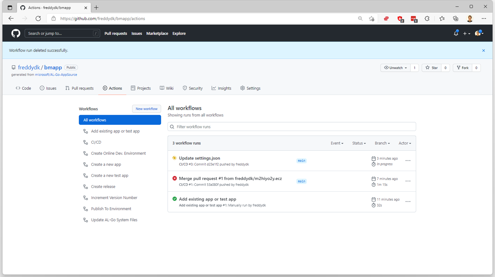

# #11 Set up CI/CD for an existing AppSource App
*Prerequisites: A GitHub account and experience from the other scenarios*
1. Navigate to [https://github.com/microsoft/AL-Go-AppSource](https://github.com/microsoft/AL-Go-AppSource) and choose **Use this template**.

1. Enter **app3** as repository name and select **Create Repository from template**.
1. My current AppSource App is using **Azure DevOps**, I download the **entire source** as a **.zip** file and place it on **Dropbox** or **Azure Blob storage** and create a **secure download Url** to the .zip file.

1. Back on github.com, under **Actions**, select the **Add existing app or test app** workflow and choose **Run workflow**. Paste in the **Secure Download URL** and choose **Run Workflow**. When the workflow finishes, complete the pull request created.
1. A CI workflow is kicked off by the pull request, this will fail with this error: *For AppSource Apps with AppSourceCop enabled, you need to specify AppSourceCopMandatoryAffixes in .AL-Go\settings.json.*
1. If you fix this and re-run, you will get another error: *When building an AppSource App, you need to create a secret called LicenseFileUrl, containing a secure URL to your license file with permission to the objects used in the app*.
1. I will use my **KeyVault from [Scenario 7](UseAzureKeyVault.md)**, by adding a secret called **AZURE_CREDENTIALS** to my GitHub repo. And then add or modify the following 3 properties in the **.AL-Go\settings.json** file:
```json
"LicenseFileUrlSecretName": "LicenseFile",
"AppSourceCopMandatoryAffixes": [ "BingMaps" ],
```
1. Meaning that the **AppSourceCopMandatoryAffixes** is set to check that I use **BingMaps** as an affix for my objects. The second setting **is only needed** if my secret is called something else than expected. AL-Go is by default looking for a secret called **LicenseFileUrl**, but you might have multiple repositories sharing the same KeyVault but needing different secrets. In this case you create a setting called **"\<secretname\>SecretName"**, specifying the actual secret name in the KeyVault. This mechanism is used for all secrets. In my **BuildVariables KeyVault**, the **LicenseFileUrl** secret is called **LicenseFile**. After these changes, my CI pipeline completes:

1. AppSource apps need to be code-signed. To achieve this, you must create two secrets in the GitHub repo or in your KeyVault. **CodeSignCertificateUrl** should be a secure download URL to your `<Code Signing Certificate>.pfx` file and **CodeSignCertificatePassword** should be the password for this .pfx file. Adding these secrets will cause the **CI** workflow and the **Create Release** workflow to sign the .app files. In the pipeline, you will see a new step.

If your secrets are called something else than **CodesignCertificateUrl** and **CodesignCertificatePassword**, you can add an indirection to the **.AL-Go\settings.json** file:
```json
"CodeSignCertificateUrlSecretName": "myCodeSignCertUrl",
"CodeSignCertificatePasswordSecretName": "myCodeSignCertPassword",
```

---
[back](../README.md)
