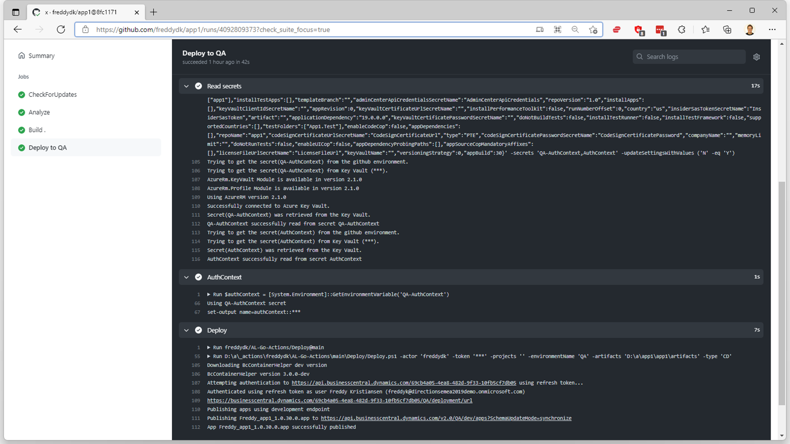

# #7 Use Azure KeyVault for secrets with AL-Go
*Prerequisites: A completed [scenario 6](UpdateAlGoSystemFiles.md), an Azure KeyVault and you will need to follow the guidelines on how to connect to an Azure KeyVault as specified here: [https://docs.microsoft.com/en-us/azure/developer/github/github-key-vault](https://docs.microsoft.com/en-us/azure/developer/github/github-key-vault). Add your KeyVault name to the the JSON construct from this walkthrough (using **“keyVaultName” : “{your keyvault name}”**) and add this JSON construct as a repository secret called AZURE_CREDENTIALS. You can also specify the KeyVault name in the AL-Go settings file if you do not wait to mess with the JSON construct.*

*Please note that the name specified in the app registration should use a verified domain of the organization (f.ex. the login from your office 365 account) and could be https://myapp.mydomainname.com)*

1. Add the **authContext** secret (see scenario 3) and the **ghTokenWorkflow** secret (see scenario 6) as secrets in your KeyVault. Remove the secrets from repository secrets and environment secrets.
1. Run the CI/CD pipeline to see that the deployment still works, reading the **authContext** secret from the KeyVault.

1. Redo scenario 6 to see that Update AL-Go System files still works.

---
[back](../README.md)
